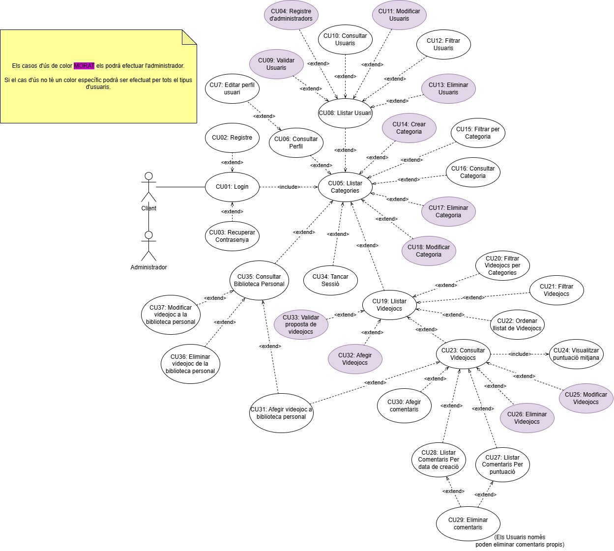

:hardbreaks:

== [aqua]#4. DIAGRAMES#

=== [aqua]#4.1. Diagrama casos d'ús#

=== [aqua]#4.2. Diagrama entitat-relació#

image::DiagramaER.jpg[Imatge del diagrama entitat-relació]

=== [aqua]#4.3. Diagrama d'arquitectura#

